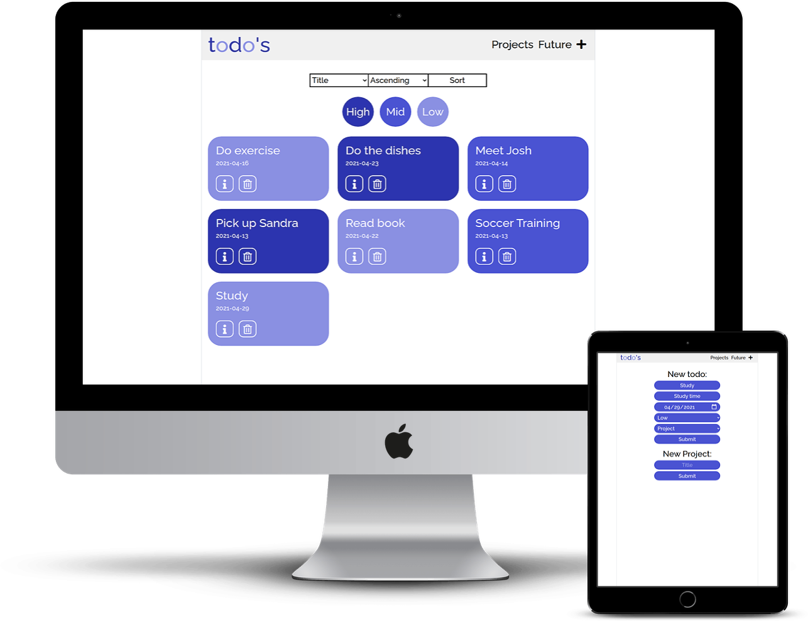

  <h1><b>to-do's</b></h1>

A mobile-responsive app for listing to-do's implemented through HTML3, CSS3 and Javascript. Users can create to-do reminders and add them to projects. The app is checking for empty inputs and duplicates. Users can also categorize their to-do's by their respective project, see future to-do's only and even sort them by priority, title or date. The to-do's are styled depending on their priority. This app uses localStorage so users can check on their to-do's again anytime. Enjoy!
   
  

## Live Version
https://cocky-ardinghelli-805b0e.netlify.app/

   

## Content

<a text-align="center" href="#about">About</a>&nbsp;&nbsp;&nbsp;|&nbsp;&nbsp;&nbsp;
<a href="#ins">Installations</a>&nbsp;&nbsp;&nbsp;|&nbsp;&nbsp;&nbsp;
<a href="#usage">Usage</a>&nbsp;&nbsp;&nbsp;|&nbsp;&nbsp;&nbsp;
<a href="#app">App</a>&nbsp;&nbsp;&nbsp;|&nbsp;&nbsp;&nbsp;
<a href="#with">Built With</a>&nbsp;&nbsp;&nbsp;|&nbsp;&nbsp;&nbsp;
<a href="#author">Author</a>

## About 
This project was a task by Microverse Inc. to build a to-do-list inluding a simple form for adding to-do's and projects, categorizing them and editing descriptions. 

## 🔧 Built with

  - [x] HTML5
  - [x] CSS3
  - [x] Vanilla Javascript
  - [x] Webpack

## Usage 
To use the code in this repository, follow the steps in this section:

### 🔨 Prerequisites
 You should have the following packages installed on your computer inorder to run the code contained herein.

- Node JS 
- npm and npx

### 🔨 Setup
First get a copy of the project on your computer:

- Clone or download the repository to a local directory on your computer by following the Github instructions at [Github clone/download repository](https://docs.github.com/en/enterprise/2.13/user/articles/cloning-a-repository).

### 🛠 Installing 
Once you have a local copy of the entire project on your computer,
If you don't meet the above prerequisites, then:

- Visit [node download and installations docs](https://docs.npmjs.com/downloading-and-installing-node-js-and-npm) to install node js and npm.

###  App 
With the installations above complete, you are set to use the code and view the application built in this repository. Follow these simple steps:

- Change directory into the directory where you cloned the repository. Forexample ``vanheaven@vanheaven-VirtualBox:~/Microverse-projects$ cd to-do-list.``
- Open the index.html file using your browser

## ✒️  Authors 

👤 **Marco Erhardt**

- Github: [@marcode95](https://github.com/marcode95)
- Linkedin: [@linkedin](https://www.linkedin.com/in/marcoerhardt95/)

## 🤝 Contributing

Contributions, issues and feature requests are welcome!

To contribute to the code base, follow the steps below:
  1. Fork this repository to your remote respository by clicking the Fork button in this repository.
  2. Clone this repository to a directory on your computer by following Github guidelines.
  3. Change directory into the directory where you cloned this repository to.
  4. Open the directory using your favorite editor.
  5. Create a feature branch off the develop branch.
  5. Make and commit the nuanced code.
  6. Open a pull request describing the improvements made
And your reward awaits in heaven.

## 👍 Show your support

Give a ⭐️ if you like this project!

## :clap: Acknowledgements
- [Design](https://www.behance.net/parth99)  